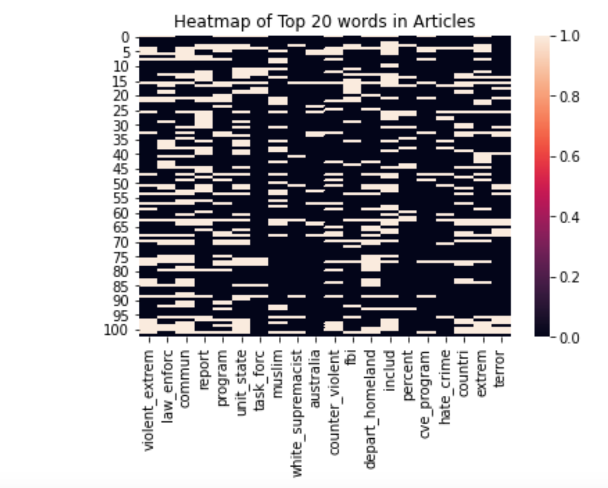
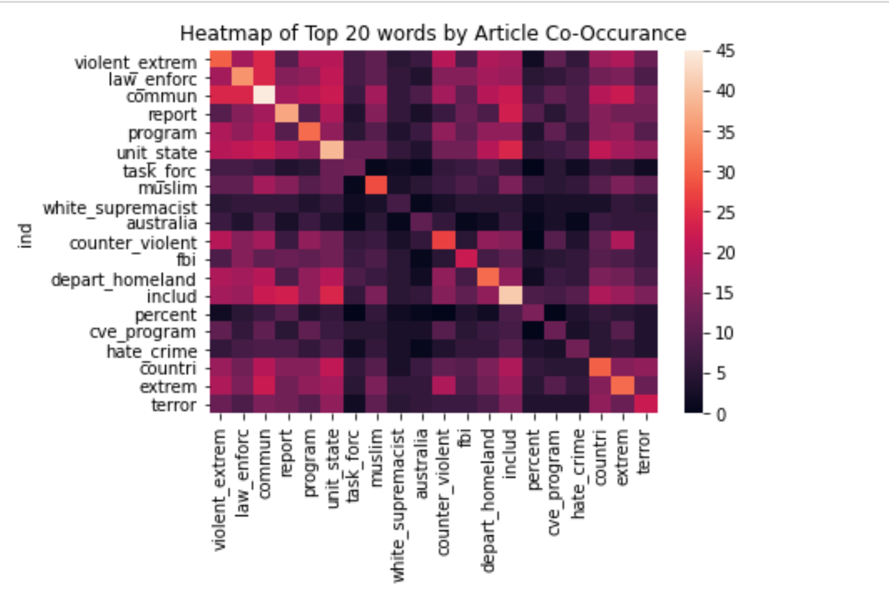

# Unsupervised Topic Modeling for News Articles

### The purpose of this repo is to exemplify how topic modeling can be achieved on an unsupervised dataset of news articles.

The dataset is taken from the thesis of Nabeela Barbari titled **`Reconsidering CVE: The Unintended Consequences of Countering Violent Extremist Efforts in America`.** The aim of this project is to see if, by using NLP techniques, we can extract similar take-aways from the list of references as Nabeela did in her thesis.

## Approach

There are many NLP approaches that can be taken on a corpus of this size like sentiment analysis, entity extraction, POS tagging, and topic modeling, to name a few. Since this corpus is unlabeled and there are not many data sources available with labeled news documents, sentiment analysis will be tricky and not necessarily accurate (however there are certainly methods of doing so, as shown in <a href="https://towardsdatascience.com/unsupervised-sentiment-analysis-a38bf1906483">this</a> article. 

Since our goal is to understand the main idea of takeaway from each article, topic modeling was our best choice of approaches, and many python libraries offer great tools to aid in topic modeling. The first approach was to use <a href="https://radimrehurek.com/gensim/models/phrases.html">gensim's Phrase</a> class to turn our list of words into bigrams, or 2-word phrases, and from there use some simple list-magic to find the most common bigrams in each article. 

We then tried a slightly more sophisticated approach to topic modeling using <a href="https://chartbeat-labs.github.io/textacy/build/html/_modules/textacy/vsm/vectorizers.html">textacy's Non Negative Matrix Factorization </a> to model our topics. The result of both methods are shown below.

## Topics of Article

### Topics From Non Negative Matrix Factorization:
(Chooses 10 topics from the entire corpus)

### Topics from Bigram Modeling:
(From each of the 100+ aricles, a topic is extracted)

These bigrams have been stemmed, meaning the words you see might appear as stemmed versions of the original word in the document (see `Topc-Modeling.ipynb` for more details on how this was done).

# Main Takeaways

In Barbari's thesis, she sets out to show that the research warrants a fundamental restructuring of the US counterterrorism strategy, namely in focusing on preventing violence rather than interdicting it. She also conclused that current CVE efforts lead to 'greater national insecurity' and lead to greater chances of radicalization.

While topic modeling cannot do a perfect job of arriving at the same conclusions as a human after reading text, it does a very good job of summarizing 1,000s of pages of text to aid in coming to similar conclusions. We can see similar words in the AI derived topic sentences that we see in Barbari's thesis, for instance, one topic from the `Topics from Gensim Bigrams` table is "counter_violen effor task_forc new_task stephani_condon". This would lead the reader to assume that the article is talking about an effort being made by a new task force to counter violence.

# Next Steps

There is much that can be done to improve this model. One thing I noticed in my research was that there do not exist great sources of labeled data on news articles, in particular news articles surrounding government, international affairs and law enforcement. If one could compile such a data set then we could train our NLP models on this specific data to arrive at better conclusions. Additionally, more time could have been spent in cleaning the data and more sofisticated cleaning methods could have been applied, perhaps like apply POS tagging and using POS rules to help aid in our bigram generation. 

Resources:
https://apps.dtic.mil/dtic/tr/fulltext/u2/1069482.pdf

