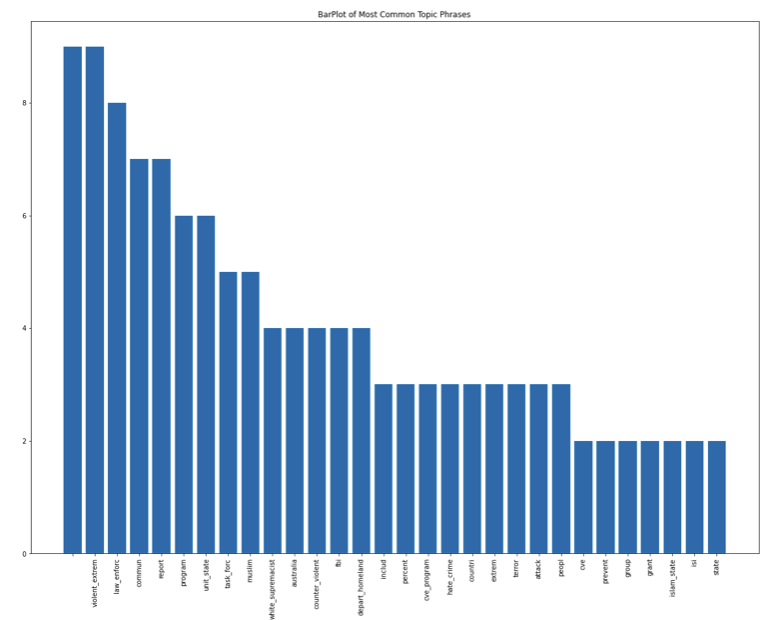
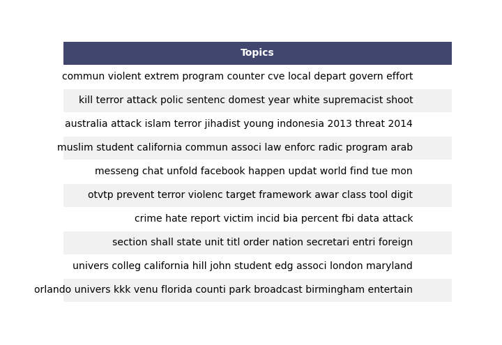
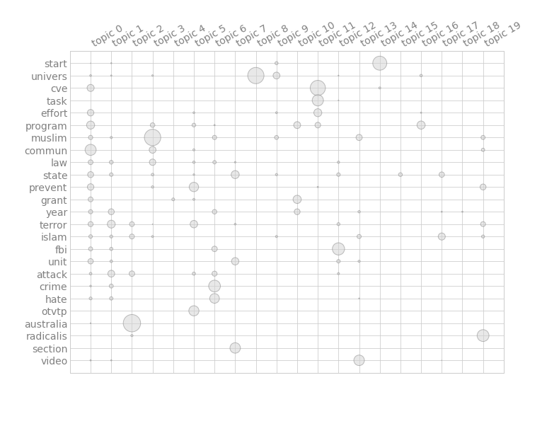
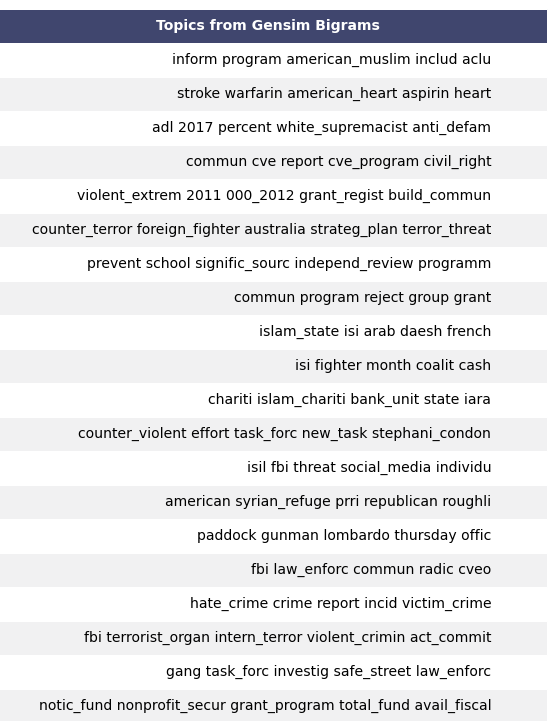

The purpose of this repo is to exemplify how topic modeling can be achieve on an unsupervised dataset of news articles.

The dataset is taken from the thesis of Nabeela Barbari titled `Reconsidering CVE: The Unintended Consequences of Countering Violent Extremist Efforts in America`. The aim of this project is to see if, by using NLP techniques, we can extract the same take-aways from the list of references as Nabeela did in her thesis.

## Topics of Article

## Topics From Non Negative Matrix Factorization:
(Chooses 10 topics from the entire corpus)

## Topics from Bigram Modeling:
(From each of the 100+ aricles, a topic is extracted)

## Main Takeaways

In Barbari's thesis, she sets out to show that the research warrants a fundamental restructuring of the US counterterrorism strategy, namely in focusing on preventing violence rather than interdicting it. She also conclused that current CVE efforts lead to 'greater national insecurity' and lead to greater chances of radicalization.

While topic modeling cannot do a perfect job of arriving at the same conclusions as a human after reading text, it does a very good job of summarizing 1,000s of pages of text to aid in coming to similar conclusions. We can see similar words in the AI derived topic sentences that we see in Barbari's thesis, for instance:

Resources:
https://apps.dtic.mil/dtic/tr/fulltext/u2/1069482.pdf

